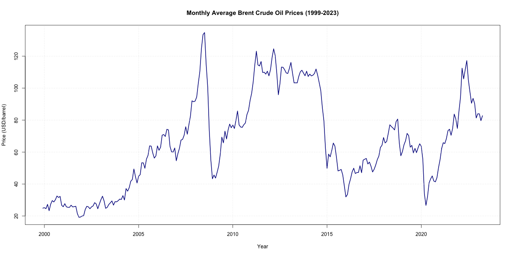
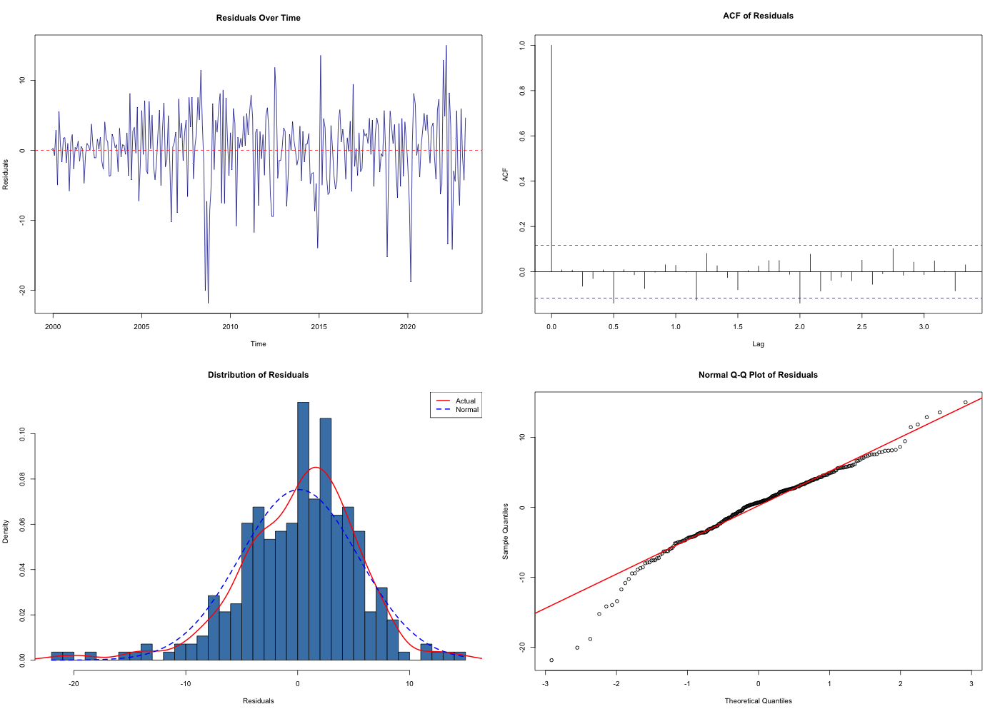
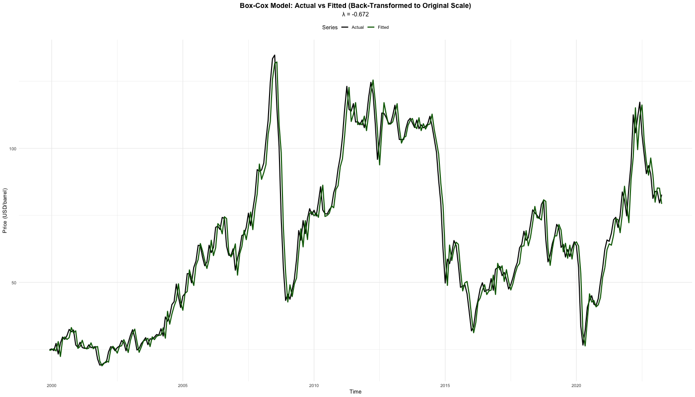

# Time Series Analysis of Brent Crude Oil Prices

[](https://www.r-project.org/)
[](https://opensource.org/licenses/MIT)

### Comparative Analysis of ARIMA and Box-Cox Transformed Models

**Author:** Bentum Welson  
**Institution:** Department of Statistics, Kwame Nkrumah University of Science and Technology  
**Course:** L200 Research Project  
**Year:** 2024-2025

---

## Abstract

This study conducts a comprehensive time series analysis of monthly Brent crude oil prices from 1999 to 2023, comparing traditional ARIMA models with Box-Cox transformed specifications. Using rigorous stationarity testing (ADF, PP, KPSS) and residual diagnostics, we identify an ARIMA(1,1,0) model as optimal. While Box-Cox transformation (λ = −0.672) provides minimal improvement in point forecast accuracy (MAPE: 6.70% vs 6.71%), it successfully eliminates ARCH effects, stabilizing conditional variance. **Key finding:** Transformation's value lies in variance stabilization for reliable interval forecasting, not point prediction improvement.

---

## Repository Contents

```
crude-oil-arima-analysis/
├── README.md                          # This file
├── ARIMACODE.r                        # Complete R analysis script
├── Report:Manuscript.pdf              # Full research manuscript (25 pages)
├── crude.csv                          # Raw data (monthly prices 1999-2023)
├── figures/                       # 13 diagnostic plots
│   ├── 01_timeseries_original.png
│   ├── 05_residual_diagnostics.png
│   ├── 09_actual_vs_fitted_boxcox_BACKTRANSFORMED.png
│   └── ...
├── tables/                        # Model diagnostics & results
│   ├── stationarity_tests.csv
│   ├── residual_diagnostics.csv
│   └── model_comparison_boxcox_vs_original.csv
└── models/
    └── final_arima_model.rds      # Saved ARIMA(1,1,0) model
```

---

## Key Results

### Model Comparison

| Model | Specification | MAE | RMSE | MAPE (%) | ARCH Effects |
|-------|--------------|-----|------|----------|--------------|
| Original Scale | ARIMA(1,1,0) | 4.026 | 5.287 | 6.712 | ✗ Present (p=0.001) |
| Box-Cox (λ=-0.67) | ARIMA(0,1,4) | 4.064 | 5.419 | 6.704 | ✓ Eliminated (p=0.121) |

### Stationarity Test Results (Original Series)

| Test | Statistic | p-value | Conclusion |
|------|-----------|---------|------------|
| ADF | -2.162 | 0.508 | Non-stationary |
| PP | -2.411 | 0.403 | Non-stationary |
| KPSS | 1.333 | 0.010 | Non-stationary |
| **After First Differencing** | | | |
| ADF | -6.525 | <0.01 | Stationary ✓ |
| PP | -11.168 | <0.01 | Stationary ✓ |
| KPSS | 0.057 | 0.100 | Stationary ✓ |

### Out-of-Sample Performance (12-Month Horizon)

- **Test RMSE:** 9.25 USD/barrel
- **Test MAPE:** 12.51%
- **Training RMSE:** 4.94 USD/barrel
- **Training MAPE:** 6.47%

---

## Quick Start

### Requirements

**R Version:** ≥ 4.3.1

**Required Packages:**
```r
install.packages(c("forecast", "tseries", "lmtest", "FinTS", 
                   "tidyverse", "ggplot2", "gridExtra", 
                   "knitr", "seastests"))
```

### Running the Analysis

```r
# Set working directory
setwd("path/to/project")

# Run complete analysis (generates all outputs)
source("BESTARIMA.r")

# Expected runtime: ~15-20 minutes
# Outputs: 13 figures, 7 tables, 1 model file
```

### Quick Example: Forecasting with the Saved Model

```r
library(forecast)

# Load the trained model
arima_model <- readRDS("output/models/final_arima_model.rds")

# Generate 12-month forecast
forecast_12mo <- forecast(arima_model, h = 12)

# Visualize
plot(forecast_12mo)

# Access predictions
forecast_12mo$mean  # Point forecasts
forecast_12mo$upper # Upper confidence bounds
forecast_12mo$lower # Lower confidence bounds
```

---

## Study Design

### Data Description
- **Source:** Bank of Ghana
- **Period:** December 1999 - April 2023
- **Observations:** 281 monthly prices
- **Price Range:** $19.17 - $134.79 per barrel
- **Mean:** $65.81, **SD:** $29.34, **CV:** 44.57%

### Methodology

**1. Stationarity Testing (Consensus Approach)**
- Three complementary tests: ADF, PP, KPSS
- Consensus rule: ≥2/3 tests must agree
- Result: d=1 (first differencing required)

**2. Model Selection**
```r
auto.arima(crude_ts, 
           seasonal = FALSE,      # No seasonality detected
           stepwise = FALSE,      # Exhaustive search
           approximation = FALSE, # Exact MLE
           trace = TRUE)          # Show all models tested
```
- **Result:** ARIMA(1,1,0) selected (AIC: 1732.28)
- **AR(1) coefficient:** φ₁ = 0.368 (SE = 0.055)

**3. Box-Cox Transformation**
```r
lambda <- BoxCox.lambda(crude_ts)  # λ = -0.672
crude_ts_boxcox <- BoxCox(crude_ts, lambda = lambda)
```

**4. Residual Diagnostics**
- Ljung-Box Test (autocorrelation)
- Shapiro-Wilk & Jarque-Bera (normality)
- ARCH Test (heteroskedasticity)
- Visual diagnostics (ACF, Q-Q plots, time plots)

**5. Train-Test Validation**
- **Split:** 80% training (224 obs), 20% testing (57 obs)
- **Split date:** Mid-2018
- **Horizon:** 12 months ahead

---

## Key Visualizations

### Figure 1: Time Series Shows Three Volatility Regimes


- **1999-2007:** Gradual upward trend ($20→$75)
- **2008-2009:** Financial crisis spike ($134.79 peak) and collapse
- **2010-2023:** High volatility with COVID-19 shock ($19.17 low)

### Figure 5: Residual Diagnostics Reveal Key Patterns


**Interpretation:**
- ✓ No autocorrelation (ACF within bounds)
- ✗ Volatility clustering visible (ARCH effects)
- ✗ Fat tails in distribution (leptokurtosis)
- ⚠️ Non-normality expected for commodity prices

### Figure 9: Box-Cox Model Back-Transformed to Original Scale


**Critical:** Always back-transform Box-Cox predictions for interpretation!

---

## Main Findings

### 1. Stationarity Achievement
✓ Crude oil prices are **non-stationary** (all 3 tests agree)  
✓ **First differencing** achieves stationarity (d=1)  
✓ No seasonal patterns detected (QS test p=1.0)

### 2. Model Adequacy
✓ ARIMA(1,1,0) passes **Ljung-Box test** (p=0.427) - no residual autocorrelation  
✗ **Non-normal residuals** detected (expected for commodity prices)  
✗ **ARCH effects** present (p=0.001) - volatility clustering

### 3. Box-Cox Transformation Impact

**Point Forecast Accuracy:** Minimal improvement
- Original MAPE: 6.71%
- Box-Cox MAPE: 6.70% (0.01% difference)

**Variance Stabilization:** Significant improvement
- ARCH effects: **Eliminated** (p=0.001 → 0.121)
- Residual variance: More uniform across time
- **Implication:** More reliable confidence intervals

### 4. Forecasting Performance
✓ **Short-term accuracy:** Test MAPE = 12.51% (good for 12-month horizon)  
⚠️ **Inherent lag:** AR(1) models react to changes, don't anticipate them  
⚠️ **Limited to 12 months:** Accuracy degrades beyond this horizon

---

## Practical Recommendations

### When to Use Each Model

| Your Goal | Recommended Model | Why |
|-----------|------------------|-----|
| **Point forecasts** (e.g., "predict $75/barrel") | Original ARIMA(1,1,0) | Simpler, equivalent accuracy |
| **Interval forecasts** (e.g., "predict $75 ± $10") | Box-Cox ARIMA(0,1,4) | Stable variance = reliable intervals |
| **Risk management** | Box-Cox model | ARCH-free residuals critical for VaR |
| **Quick operational forecast** | Original ARIMA | Faster, adequate for point estimates |

### Implementation Guide

**Scenario 1: Operational Forecasting (Point Estimates)**
```r
model <- readRDS("output/models/final_arima_model.rds")
forecast_6mo <- forecast(model, h = 6)
print(forecast_6mo$mean)  # Point predictions
```

**Scenario 2: Risk Analysis (Need Intervals)**
```r
# Use Box-Cox model for reliable prediction intervals
lambda <- -0.672
ts_transformed <- BoxCox(crude_ts, lambda)
model_box <- auto.arima(ts_transformed)
forecast_box <- forecast(model_box, h = 6)

# Back-transform to original scale
forecast_original <- InvBoxCox(forecast_box$mean, lambda)
upper_original <- InvBoxCox(forecast_box$upper[,2], lambda)
lower_original <- InvBoxCox(forecast_box$lower[,2], lambda)
```

### Important Caveats

⚠️ **AR(1) Limitation:** Model tracks prices with 1-period lag (inherent to autoregressive structure)  
⚠️ **Non-normality:** Use bootstrapped CIs for hypothesis testing  
⚠️ **Horizon:** Reliable only for 3-12 month forecasts  
⚠️ **Structural breaks:** Model doesn't account for regime shifts (2008 crisis, 2020 pandemic)

---

## Suggested Extensions

### Immediate Improvements
1. **GARCH Models:** Capture volatility clustering explicitly
   ```r
   library(rugarch)
   spec <- ugarchspec(variance.model = list(model = "sGARCH"))
   ```

2. **Structural Break Tests:** Identify regime change points
   ```r
   library(strucchange)
   bp_test <- breakpoints(crude_ts ~ 1)
   ```

3. **Exogenous Variables:** Include OPEC production, geopolitical events

### Advanced Methods
- ARIMA-GARCH hybrid models
- Regime-switching models (Markov-switching)
- Machine learning (LSTM, XGBoost) for nonlinear patterns
- Multivariate models (VAR) with related commodities

---

## Study Limitations

1. **Data truncation:** May-December 2023 not included (incomplete at analysis time)
2. **Linear assumption:** ARIMA may miss threshold effects or regime-switching
3. **No exogenous factors:** OPEC decisions, geopolitical events not modeled
4. **Single commodity:** No cross-commodity dynamics (WTI, natural gas)

---

## Citation

```
Welson, B. (2025). Time Series Modeling of Brent Crude Oil Prices: 
A Comparative Analysis of ARIMA and Box-Cox Transformed Models. 
Department of Statistics, Kwame Nkrumah University of Science and Technology.
```

**BibTeX:**
```bibtex
@techreport{welson2025crude,
  title={Time Series Modeling of Brent Crude Oil Prices: A Comparative Analysis of ARIMA and Box-Cox Transformed Models},
  author={Welson, Bentum},
  year={2025},
  institution={Kwame Nkrumah University of Science and Technology},
  type={L200 Research Project}
}
```

---

## Reproducibility

All results are **fully reproducible** using:
- Random seed: 23 (set in script)
- R version: 4.4.2
- Complete code in `BESTARIMA.r`

To reproduce exact results:
```r
set.seed(23)
source("BESTARIMA.r")
```

---

## File Descriptions

| File | Description |
|------|-------------|
| `BESTARIMA.r` | Complete analysis script (1000+ lines, fully commented) |
| `Report:Manuscript.pdf` | Research manuscript with detailed methodology and findings |
| `BESTARIMA.tex` | LaTeX source with embedded R output |
| `crude.csv` | Raw monthly price data (1999-2023) |
| `output/figures/*.png` | 13 diagnostic and visualization plots |
| `output/tables/*.csv` | Model diagnostics, accuracy metrics, comparisons |
| `output/models/*.rds` | Saved R model objects for reuse |

---

## Contact

**Bentum Welson**  
Kwame Nkrumah University of Science and Technology, Ghana
-bentumwelson523@gmail.com

For questions about this research, please open an issue in this repository.

---

## Acknowledgments

- Bank of Ghana for data access
- R Core Team and package developers (`forecast`, `tseries`, `ggplot2`)
- KNUST Department of Statistics for computational resources

---

## License

This project is available for academic and research use. Please cite appropriately.

---

**Keywords:** Time Series Analysis · ARIMA · Box-Cox Transformation · Crude Oil Prices · Brent · Stationarity Testing · Volatility Modeling · R Programming · Energy Economics
